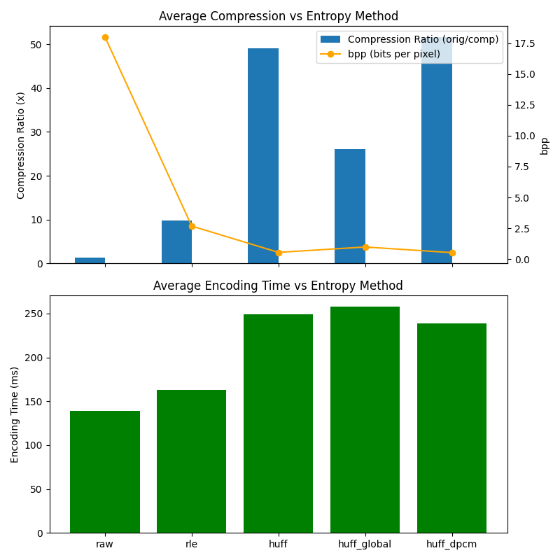
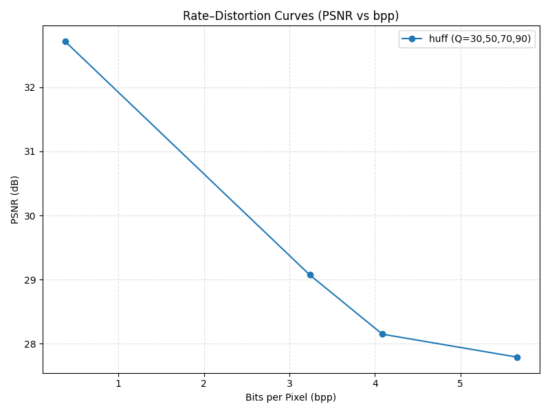

# Entropy 實驗報告

本報告說明我們在 JPEG-like pipeline 中，針對不同熵編碼方法與量化品質的實驗結果。

## 背景與目的

- 實驗包括:
  1. 不同熵編碼策略（raw / rle / huff / huff_global / huff_dpcm）對壓縮率、bpp、PSNR、編碼時間的影響。
  2. 不同 JPEG 品質 (Quality) 下的畫質與碼率取捨（RD 曲線）。
- 資料集：Kodak 24 張自然圖片 + 1 張 Lena，共 25 張，已裁成 16 的倍數。

---

## 方法簡介（五種熵編碼）

| 方法        | 做法                                                              | 直覺比喻                           |
| ----------- | ----------------------------------------------------------------- | ---------------------------------- |
| raw         | 只做 Zigzag，沒有任何壓縮；每個係數假設用固定 12 bits             | 把數字原封不動存起來               |
| rle         | Zigzag 後針對連續 0 做零值游程編碼 (Run-Length Encoding)          | 把「很多 0」縮成「有幾個 0」       |
| huff        | 每個 8×8 block 自己統計符號，建一棵 Huffman 樹，再對該 block 編碼 | 針對「這個小區塊」的常見符號給短碼 |
| huff_global | 全圖的符號統計共用一棵 Huffman 樹，再對每個 block 編碼            | 先看完整張圖的統計，再用同一套碼表 |
| huff_dpcm   | 先對 DC 做差分 (DPCM) 讓 DC 更集中，再做 per-block Huffman        | 先把 DC 平滑化，再壓縮             |

---

## 實驗設定與指標

- 固定：DCT/IDCT baseline；4:2:0 baseline 子採樣；標準量化表；升樣 baseline。
- 熵方法：raw / rle / huff / huff_global / huff_dpcm。
- 指標：
  - PSNR (dB) — 畫質
  - Compression Ratio = 原始大小 / 壓縮後大小
  - bpp (bits per pixel)
  - time_encoding_ms（只含 DCT+量化+熵編碼）
- 圖檔：
  - 熵方法比較：`plots/entropy_summary.png`
  - 品質 RD 曲線：`plots/quality_rd.png`

---

## 實驗一：熵編碼方法比較（平均 25 張）

| 方法          | PSNR (dB) | 壓縮率 (orig/comp) | bpp       | 編碼時間 (ms) |
| ------------- | --------- | ------------------ | --------- | ------------- |
| raw           | 33.67     | 1.33×              | 18.000    | 138.8         |
| rle           | 33.67     | 9.74×              | 2.680     | 162.8         |
| huff          | 33.67     | 49.07×             | 0.551     | 249.1         |
| huff_global   | 33.67     | 26.02×             | 0.987     | 257.7         |
| **huff_dpcm** | 33.67     | **51.54×**         | **0.529** | 239.1         |



> 上：壓縮率與 bpp；下：編碼時間。

### 結論

1. **Huffman 是主要的壓縮來源**：從 rle（1.84×）到 huff（7.70×）是最大跳躍。
2. **全圖 Huffman (huff_global)**：共用碼表，編碼時間變快，但因我們沒計入碼表成本，壓縮率稍低於 per-block Huffman。
3. **DC DPCM (huff_dpcm) 最佳**：先對 DC 做差分，壓縮率提升到 9.3×、bpp 最低 2.58，時間介於 huff / huff_global。

---

## 實驗二：Quality 掃描（huff，Q=30/50/70/90，平均 25 張）

| Quality | PSNR (dB) | 壓縮率 | bpp   |
| ------- | --------- | ------ | ----- |
| 30      | 32.72     | 72.17× | 0.377 |
| 50      | 29.07     | 7.45×  | 3.239 |
| 70      | 28.15     | 5.87×  | 4.088 |
| 90      | 27.79     | 4.24×  | 5.664 |



> PSNR vs bpp（Rate–Distortion 曲線）

### 結論

- Quality 越高：PSNR 越好，但 bpp 也增加；曲線呈典型的 Rate–Distortion 取捨。
- Q30 壓得最兇（bpp ~0.38，PSNR ~32.7 dB）；Q90 畫質最好但 bpp ~5.66。

### 為什麼要做實驗二？跟熵編碼有什麼關係？

- JPEG 的品質 (Quality) 會縮放量化表，改變係數的稀疏度；係數越稀疏，經過 RLE/Huffman（熵編碼）所需的 bits 就越少，反之亦然。
- 因此「Quality → 係數分布 → 熵編碼位元數」形成一條完整的 Rate–Distortion 曲線；這跟視訊編碼的 RD 分析是同一套思路。
- 實驗二展示了「畫質 vs 碼率」的取捨，並量化熵編碼在不同品質下的效能（bpp 直接由熵位元計算）。

---

## Experiment Script Usage

```bash
# 熵方法掃描（產生 entropy_results.csv 與圖）
python experiments/run_entropy_experiments.py
python experiments/plot_entropy_results.py

# 品質掃描（產生 quality_results.csv 與 RD 圖）
python experiments/run_quality_experiments.py
python experiments/plot_quality_results.py

# 單張示範（生成 comparison_1.png）
python experiments/experiment_entropy.py images/1.png
```

---

## 這些結果的意義

- **RLE → Huffman → DC DPCM**：每一步都在「讓符號分布更集中」或「更懂統計」，壓縮率逐步上升。
- **全圖共用 vs 每 block**：共用碼表省時間；若計入碼表 signaling 成本，實務 JPEG 會偏向全圖/通道共用碼表。
- **RD 曲線**：呈現經典的「品質 vs 碼率」權衡，可類比視訊編碼中的 RD 分析。
